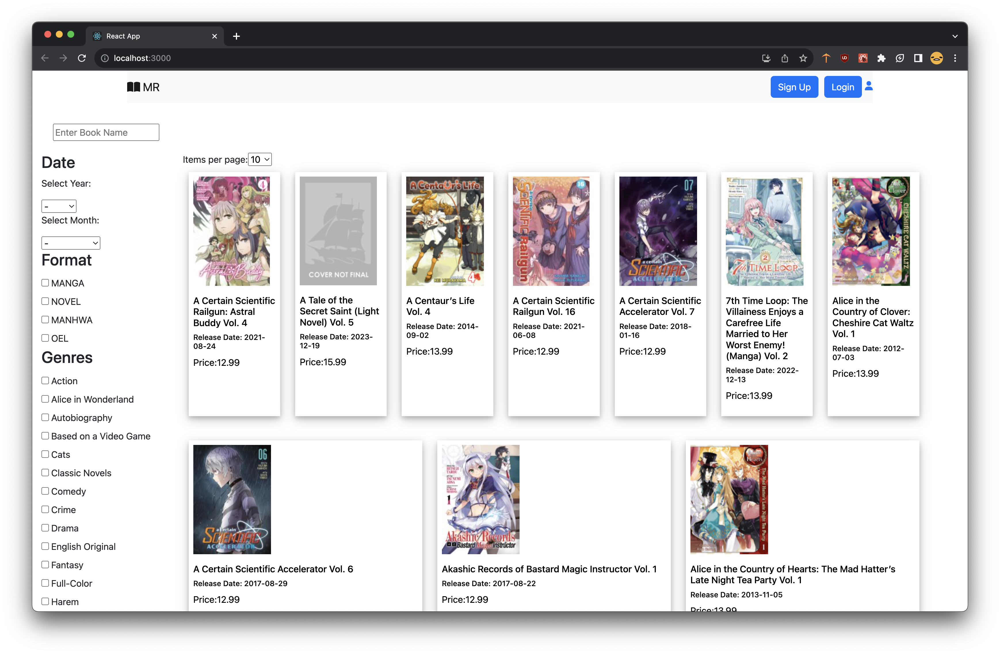
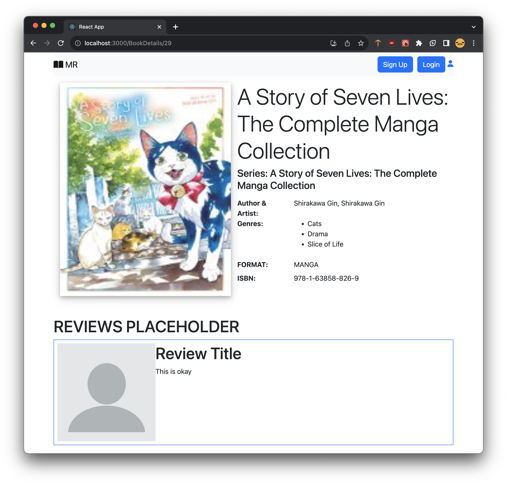

# MangaReleases
MangaReleases is a web application to see scraped book information (ex. title, author, artist, release date,...) from public publishing sites (ex. Seven Seas, Yen Press).
This project is still in work-in-progress. Currently, only Seven Seas data has been scraped. The scraping of data and storing the data in a database is complete. Additionally, API end points are availabe for the front-end to call 
to get the data and display it. Users can cycle through pages to view books and select one to see more information

## Demo Images
### Home Page

### Book Details

